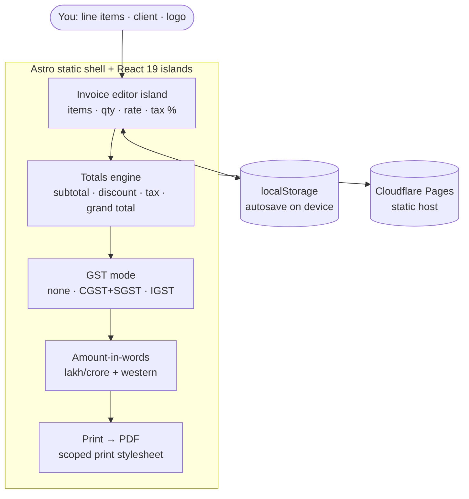

# oriz-invoice

> GST-aware invoice generator — line items, auto totals + tax, multi-currency, logo, print → PDF, amount-in-words. 100% client-side, no signup.

[](LICENSE)
[](https://github.com/chirag127/oriz-invoice/stargazers)
[](https://github.com/chirag127/oriz-invoice/commits)
[](https://astro.build)

**Live app:** https://invoice.oriz.in · **About:** https://chirag127.github.io/oriz-invoice/ · **Repo:** https://github.com/chirag127/oriz-invoice

A free, GST-aware invoice generator for freelancers and small businesses in India (and beyond). Add line items and get live totals, tax breakup (CGST+SGST or IGST), multi-currency formatting, your logo, and a clean print-to-PDF — including amount-in-words. Everything runs in your browser: invoice data is stored only in `localStorage` on your device and never leaves it.

⭐ If this is useful, please [star the repo](https://github.com/chirag127/oriz-invoice/stargazers) — it helps others find it.

## How it works



## Features

- **Line items** — description, qty, rate, per-line tax %, live amount.
- **Auto totals** — subtotal, discount, tax, shipping, grand total.
- **GST modes** — no tax · CGST+SGST (intra-state) · IGST (inter-state), with tax breakup by rate.
- **Multi-currency** — INR, USD, EUR, GBP, AED, AUD, CAD, SGD, JPY (locale-correct formatting).
- **Amount-in-words** — INR-aware (lakh/crore) + western scale for other currencies.
- **Logo upload** — click or drag-drop an image.
- **Client + business details** including GSTIN.
- **Print → PDF** — scoped print stylesheet, receipt-paper preview.
- **Export / import** invoice as JSON.
- **Autosave** to `localStorage`; no signup, no server, no AI.

## Tech stack

- **Astro 6** static output.
- **React 19** islands for the interactive editor.
- **Tailwind CSS v4** with a bespoke per-site theme.
- **Shared `@chirag127/oz-*` packages** — `oz-chrome` (shell), `oz-tokens-base` (tokens), `oz-file` (file helpers).
- **[sharp](https://sharp.pixelplumbing.com/)** (dev dependency) — icon generation at build time.
- **Vitest** — unit tests over pure logic (totals, tax, number-to-words).
- **Cloudflare Pages** — static hosting. Installable PWA.

## Repo structure

```
oriz-invoice/
├── src/
│   ├── pages/          # Astro routes (invoice editor)
│   ├── components/      # React islands (editor, totals, preview)
│   ├── lib/            # totals, tax modes, number-to-words
│   ├── layouts/        # base HTML layout / meta
│   └── styles/         # Tailwind v4 entry + print stylesheet
├── tests/             # Vitest specs (totals, tax, words)
├── public/            # static assets, icons, manifest
└── astro.config.mjs   # Astro config
```

## Screenshots

See the live app in action at **https://invoice.oriz.in**.

## Quick start

```bash
npm install --legacy-peer-deps
npm run dev       # local dev server
npm run test      # vitest — pure logic (totals, tax, words)
npm run build     # static build → dist/
npm run deploy    # build + wrangler pages deploy (Cloudflare Pages)
```

> Windows: use **npm** (pnpm skips `@esbuild/win32-x64` and the Astro build crashes).

## Configuration

Fully client-side — **no environment variables required**. Invoice data lives only in your browser's `localStorage`.

## Part of the oriz family

One of ~80 sites in the [oriz](https://blog.oriz.in) family — a fleet of small, fast, client-side tools that run **$0 on the Cloudflare free tier**.

> **Hosting:** the canonical live app is served from **Cloudflare Pages** at [invoice.oriz.in](https://invoice.oriz.in). GitHub Pages serves a separate info/landing page at [chirag127.github.io/oriz-invoice](https://chirag127.github.io/oriz-invoice/).

## Related projects

- [oriz-finance](https://github.com/chirag127/oriz-finance) — finance calculators (EMI, SIP, tax…).
- [oriz-text](https://github.com/chirag127/oriz-text) — writing-desk text toolkit.
- [oriz-color](https://github.com/chirag127/oriz-color) — color studio.
- [oriz-img](https://github.com/chirag127/oriz-img) — in-browser image toolkit.

## Contributing

Issues and PRs welcome. Conventional commits are the changelog.

## Status

Stable.

## License

MIT © 2026 Chirag Singhal · chirag@oriz.in
